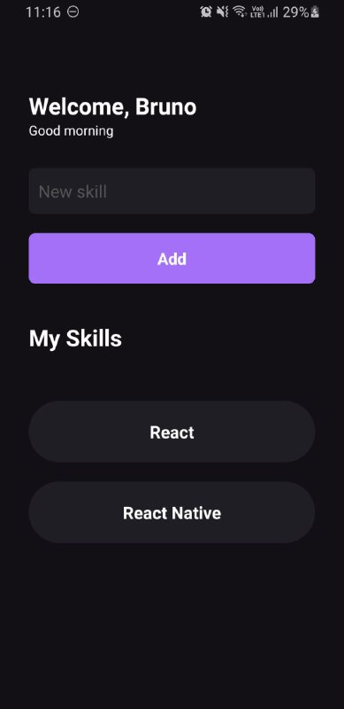
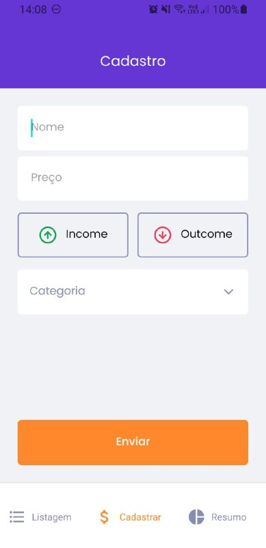
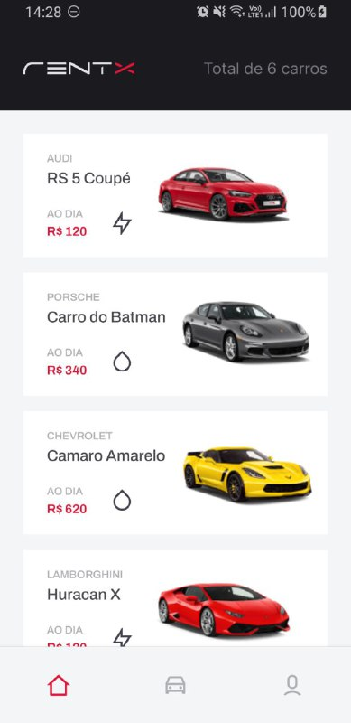

<h1 align="center">
  Ignite Trilha React Native
</h1>

## Sobre

Durante o curso Ignite foi desenvolvida algumas aplicações, para mostrar e fixar os conteúdos ensinados na prática.

---

## Grade do curso

## Chapter I

- ### Fundamentos React Native

Vamos aprender o ecossistema do desenvolvimento mobile com React Native, criar e compreender a estrutura de projetos React Native com a CLI além de conhecer os principais conceitos por volta da biblioteca como componentes, propriedades, estado, imutabilidade, hooks, estilização e utilização do TypeScript.

- ### Desafios

    - Desafio: Conceitos do React Native
    - Desafio: Adicionando edição e alertas

## Chapter II

Neste capítulo criaremos uma aplicação completa utilizando React Native, TypeScript e Styled Components (CSS-in-JS) para ir mais a fundo em estilização e criação de interfaces no React Native baseando-se em um layout do Figma. Você também irá aprender a utilizar API Nativas, Armazenamento Local com Async Storage, Navegação, Formulários e Login Social. E para dar um Booster na produtividade vamos utilizar o Expo Bare Workflow.

- ### Expo Styled Components

Neste módulo você irá conhecer o Expo, um Framework que nos oferece um conjunto de ferramentas e serviços criados em torno de plataformas React Native que irão turbinar o nosso desenvolvimento. E você também irá aprender a utilizar o Styled Components para criar interfaces com o conceito de CSS-in-JS, ou seja, que nos permite escrever códigos CSS dentro do Javascript. E por que eu deveria usar o Styled Components? A resposta é simples: praticidade.

- ### Formulários e Navegação

Neste módulo você irá aprender a utilizar o React Hooks Forms com a proposta de criar formulários flexíveis, com formas simples de fazer validação e sem renderizações desnecessárias. Também você irá aprender a criar a navegação entre telas mobile.

- ### Async Storage

Neste módulo você irá aprender a utilizar o Async Storage para armazenar dados no dispositivo do usuário. O Async Storage  é uma ótima estratégia de armazenamento quando não há muitas regras e relacionamento envolvido, pois o sistema de armazenamento é simples e baseado em chave e valor (key-value), assíncrono e persistente. E de quebra, vamos criar o gráfico da nossa aplicação.

- ### Contextos e Autenticação

Neste módulo você irá aprender a utilizar Login Social com OAuth Authentication que é uma estratégia incrível que permite utilizar os dados do usuário de uma conta já existente, como por exemplo, uma conta Google. A autenticação com Login Social traz conforto para o usuário que não precisa criar uma nova conta do zero e pode ir direto para o que realmente interessa que é utilizar nosso App. E tem mais, neste módulo você também irá aprender a utilizar a Context API para compartilhar dados com toda a sua aplicação (ou parte dela). E de quebra, você irá aprender a criar o seu próprio Hook. Utilizaremos essa combinação perfeita para armazenar e acessar os dados do usuário em um único lugar.

- ### Desafios

    - Desafio: SavePass
    - Desafio: Login Social com Twitch

## Chapter III

- ### Consumindo API

Neste módulo você irá aprender a integrar sua aplicação React Native com uma API. Você irá compreender os métodos do protocolo HTTP, lidar com requisições e respostas realizadas a uma API. Para integrar e consumir API utilizaremos o Axios.

- ### Animações

Hora de levar nossos conhecimentos sobre o desenvolvimento de interfaces para o próximo nível conhecendo e aplicando na prática ferramentas e técnicas que estarão presentes nas sua aplicações no futuro aplicando boas práticas de UX e Animações.

- ### Desafios

    - Desafio: GitHub Explorer

## Chapter IV

- ### Offline First

É hora de implementar a estratégia de Offline First para que algumas funcionalidades da nossa aplicação funcione sem conexão com internet utilizando um banco de dados local mais robusto.

### Chapter V

Nesse módulo vamos entender como criar testes automatizados no React Native garantindo que nossos componentes e funcionalidades continuem funcionando independente de novas manutenções. E também, irá aprender como performar suas aplicações.

- ### Testes no React Native

Testes automatizados é uma excelente estratégia para garantir que componentes e funcionalidades continuem funcionando independente de novas manutenções.

- ### Perfomando Apps

Em em aplicações mobile você pode ter a preocupação com performance e, por isso, nesse módulo entenderemos como performar aplicações no React Native entendendo como funcionam os algoritmos internos da biblioteca e todo fluxo de renderização de componentes.

### Chapter VI

Chegou o momento de disponibilizar os seus Apps para os seus usuários. Por isso, aqui vamos entender as técnicas de publicação de Apps e compreender como realizar o deploy de nossas aplicações com o fluxo de CI/CD.

- ### Publicação de Apps

Nesse módulo aprenderemos a enviar a aplicação para Android à Google Play Store e o app iOS para Apple Store para disponibilizarmos nossa aplicação para o mundo.

- ### Fluxo de CI/CD

Nesse módulo vamos buscar automatizar o processo de criação das próximas builds para as nossas aplicações assim que uma novar versão for enviada para o repositório. E para isso, vamos implementar a estratégia de CI/CD, isto é, Continuous Integration e Continuous Delivery.

- ### Desafios

    - Desafio: Deploy do GoFinances

---

## Screenshots

### Myskills

  
  

### GoFinances

  
   
  
  

### Rentx

  
  
  
  

